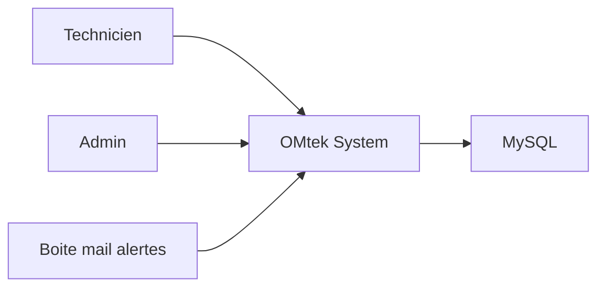
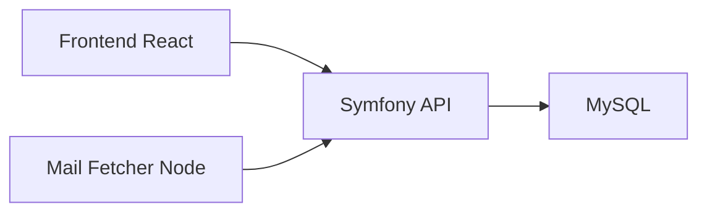
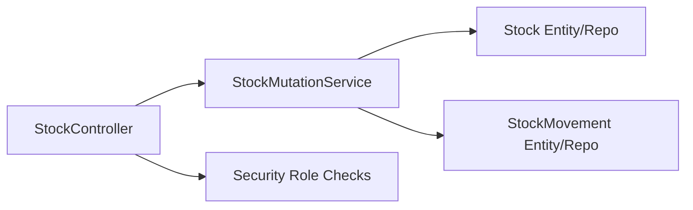
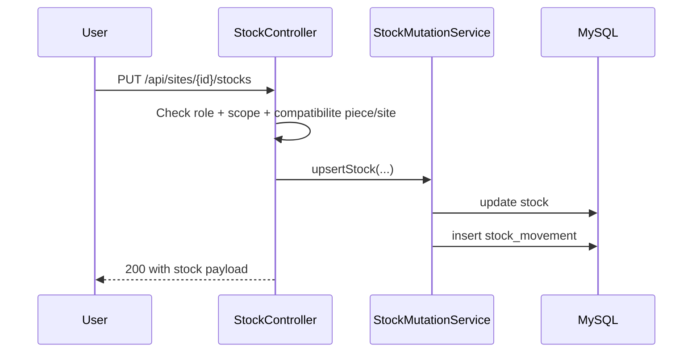

# Audit Architecture OMtek (Software Architect Review)

Date: 2026-03-12

## 1. Architecture Analysis

### Context

- Product domain: supervision de parc imprimantes, stock terrain, interventions.
- Business goals:
  - action rapide technicien sur mobile
  - zero fuite des stocks admin-only
  - tracabilite des actions terrain
  - base evolutive pour supervision admin et gouvernance.
- Constraints:
  - stack imposee: Symfony + React + mail-fetcher Node
  - perimetre deja en production locale et migration incrmentale
  - budget/temps contraints (priorite V1 operationnelle).
- Assumptions:
  - equipe petite a moyenne
  - besoin de livraison continue sans big-bang rewrite
  - compliance moderee mais auditabilite metier importante.

### Architecture Drivers (ranked)

1. Securite metier par role (admin vs technicien)
2. Maintainability et vitesse d evolution
3. Auditabilite des mouvements/interventions
4. Disponibilite et simplicite d exploitation
5. Performance frontend mobile

### Quality attribute scenarios

- Scenario S1 (security):
  - Stimulus: un technicien appelle les endpoints stock.
  - Environment: production, token valide `ROLE_TECH`.
  - Response: aucune donnee `ADMIN_ONLY` n est retournee.
  - Measure: 0 fuite sur payload et totaux.

- Scenario S2 (auditability):
  - Stimulus: un utilisateur modifie un stock site.
  - Environment: charge nominale.
  - Response: un mouvement trace delta/avant/apres/motif/utilisateur.
  - Measure: 100% des mutations stock tracables.

- Scenario S3 (change velocity):
  - Stimulus: ajout d une nouvelle regle intervention.
  - Environment: sprint court.
  - Response: changement limite a modules API+UI concernes.
  - Measure: delai implementation <= 1 sprint sans regression majeure.

### Current risks

- [P1] Couverture de tests executable absente (runner PHPUnit non installe).
- [P1] UI admin de gestion utilisateurs incomplete cote frontend.
- [P2] Bundle frontend unique assez lourd (~633 kB minifie).
- [P2] Quelques pages frontend restent denses (complexite cognitive elevee).

## 2. System Design Proposal

### Candidate options

| Option | Style | Strengths | Risks | Score |
|---|---|---|---|---|
| A | Modular monolith (Symfony) + frontend React | Complexite ops faible, iteration rapide, boundaries metier explicites | Discipline necessaire sur les limites modulaires | 8.5/10 |
| B | Microservices API | Isolation forte et scaling independant | Taxe ops, complexite distribuee prematuree | 6/10 |
| C | Event-driven majoritaire des maintenant | Bonne decouplage futur | Surcout design/replay sans besoin immediat | 6.5/10 |

### Recommended target architecture

- Chosen style: `modular monolith` avec principes hexagonaux a l interieur des modules metier.
- Why this option:
  - aligne avec taille equipe et maturite ops actuelle
  - couvre besoins role/audit sans complexite distribuee excessive
  - migration evolutive possible vers services plus tard.
- Why alternatives were not selected:
  - microservices trop couteux maintenant
  - event-first global trop complexe avant stabilisation metier.

### Bounded contexts

| Boundary | Responsibilities | Data owner | Interface |
|---|---|---|---|
| Auth & Users | login, token, profil, creation user admin | `user` | REST `/api/auth`, `/api/users` |
| Supervision | dashboard technicien, etat parc/alertes | `alerte`, `rapport_imprimante`, agregats | REST `/api/dashboard`, `/api/sites` |
| Stock | stock global/site, scopes, mouvements | `stock`, `stock_movement` | REST `/api/stocks`, `/api/sites/{id}/stock-movements` |
| Intervention | cycle de vie interventions | `intervention` | REST `/api/interventions` |
| Catalogue | modeles/pieces/compatibilites | `modele`, `piece`, `modele_piece` | REST `/api/modeles`, `/api/pieces` |

### Runtime topology

- Entry points:
  - React/Vite frontend
  - Symfony API
  - Node mail-fetcher (ingestion).
- Internal communication: majoritairement synchrone REST.
- Async channels: pas de broker central pour le moment.
- Data stores: MySQL (Doctrine ORM).

### Consistency and transactions

- Local transaction boundaries: mutation stock + mouvement dans meme transaction.
- Cross-boundary strategy: pas de transaction distribuee, orchestration applicative simple.
- Consistency model:
  - forte sur stock et intervention
  - eventual pour certaines vues de supervision calculees.

## 3. Code Architecture Blueprint

### Folder structure cible (incrementale)

```text
api/src/
  Controller/Api/
  Entity/
  Service/
  Repository/
frontend/src/
  pages/
  api/
  context/
docs/
```

### Dependency rules

- Controllers -> Services -> Entities/Repositories
- Aucun contournement des regles role cote frontend uniquement
- Les enums metier centralisent les vocabulaires critiques

### Module contract guidelines

- DTO JSON stables pour endpoints publics
- erreurs standardisees (`error` string) pour parcours UI
- evolution backward-compatible via champs optionnels

### Ownership model

- API role/security: ownership backend
- UX mobile technicien: ownership frontend
- schemas/decision records: ownership transverse (architect + lead dev)

## 4. Recommended Patterns

### Chosen patterns

- Modular monolith par domaines metier
- Service applicatif pour mutations stock (`StockMutationService`)
- Enum-driven domain constraints (status, scope, reason)
- Audit trail via `StockMovement`

### Anti-patterns avoided

- Shared mutable logic frontend-only pour les permissions
- distributed transactions lourdes
- microservices prematures

## 5. Technology Stack Suggestions

| Layer | Current | Recommendation | Tradeoff note |
|---|---|---|---|
| Backend | Symfony 8 + Doctrine | Keep | Bon compromis vitesse/structure |
| Frontend | React + Vite + TS | Keep + code split progressif | warning bundle a traiter |
| DB | MySQL | Keep | schema deja stabilise V1 |
| Messaging | none | Defer | evaluer apres stabilisation supervision |
| Tests | skeleton only | Installer PHPUnit + BrowserKit | priorite haute qualite |

## 6. Documentation Pack

### ADR backlog (propose)

- ADR-001: Choix modular monolith pour V1
- ADR-002: Separation stock `TECH_VISIBLE` vs `ADMIN_ONLY`
- ADR-003: Strategie d audit des mouvements de stock
- ADR-004: Politique de permissions interventions technicien/admin
- ADR-005: Strategie de tests integration role-based

### Draft ADR example

#### ADR-002: Separation des scopes de stock

- Context: exigence client de non-fuite reserve admin
- Decision: `StockScope` + filtrage API strict + mouvements scopes
- Consequences:
  - Positive: regle enforcee cote backend
  - Negative: complexite supplementaire UI/queries
  - Neutral: besoin de tests integration role

### C4 diagram plan

- System context: OMtek et acteurs
- Container: frontend/api/mail-fetcher/db
- Component: module stock/intervention
- Sequence: mise a jour stock + trace mouvement

## 7. Architecture Diagrams

### System context



### Container view



### Component view (stock)



### Critical sequence



## 8. Best Practices Checklist

- [x] Bounded contexts principaux identifies
- [x] Regles role sensibles enforcees cote API
- [x] Trace des mouvements de stock en place
- [ ] Architecture tests automatiques en CI
- [ ] CODEOWNERS et review gates explicites
- [ ] SLOs et alerting formalises
- [ ] Bundle budget frontend enforce en CI

## 9. Validation & Governance Plan

### Architecture fitness functions

- Deptrac (PHP) pour regles de dependances
- Tests integration roles (stock/intervention/dashboard)
- Budget taille bundle frontend dans pipeline

### Quality gates CI cibles

- `php bin/console doctrine:schema:validate`
- `php bin/console lint:container`
- `npx tsc --noEmit`
- `vendor/bin/phpunit` (apres installation deps)

## 10. Risks & Migration Plan

### Top risks

1. Absence actuelle de tests executables automatises
2. regression possible sur permissions role sans suite integration
3. complexite croissante de pages frontend monolithiques

### Incremental migration steps

1. Installer les dependances tests et activer premiers tests integration roles
2. Cibler d abord stock scope + stock movements + interventions
3. Ajouter ecran admin gestion utilisateurs
4. Introduire split frontend progressif (lazy routes/pages)
5. Mettre en place gouvernance ADR + checklist revue architecture mensuelle
